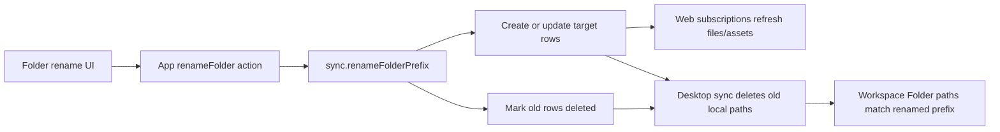

# Folder-prefix rename operation

Commit: `b8caddd41840ce4ed0b0fca3cdca8d05187249d6`

No sibling `PRODUCT.md` exists. This spec covers GitHub issue #47: implement a backend-level folder-prefix rename before exposing folder rename in the UI.

## Context

Folders are inferred from Markdown File and Asset path prefixes. There is no folder table. A folder rename is therefore a batch path rewrite for every row whose `path` starts with the old folder prefix.

Relevant domain terms from `CONTEXT.md`:

- A Workspace is the logical unit.
- Web Workspaces are synced and read/write through Convex.
- Desktop Workspace Folders read/write local files, then Cloud Sync reconciles to Convex when enabled.
- Assets are binary files referenced by Markdown Files, commonly under `<markdown-file-stem>.assets/<hash>.<ext>`.

Current architecture:

- `packages/sync-backend/convex/schema.ts` stores `files` and `assets` rows with `workspaceId`, `path`, `updatedAt`, `deviceId`, and `deleted`.
- `packages/sync-backend/convex/sync.ts` owns Convex queries and mutations for file/asset push, soft delete, listing, upload URLs, orphan asset cleanup, and debug edits.
- `packages/sync/src/sync.ts` treats `deleted: true` rows as tombstones. Existing devices delete local paths when the remote row for that exact path is tombstoned.
- `packages/convex-client/src/index.ts` adapts Convex functions to the backend-agnostic `SyncBackend` interface.
- `packages/ui/src/components/Sidebar.tsx` infers folders from file paths, persists expanded state by folder id, and currently supports file rename plus folder create/delete affordances.
- `apps/www/src/shell/Sidebar.tsx` renders the shared sidebar without rename/create/delete callbacks.
- `apps/desktop/src/components/Sidebar.tsx` wires file rename/create/delete and folder delete to local filesystem actions.

ADR constraints:

- ADR 0001 says unreferenced asset cleanup is delayed; folder rename must not delete blobs eagerly.
- ADR 0002 keeps desktop filesystem access inside Electron main and exposes only typed renderer APIs.

## Affected apps and packages

- `packages/sync-backend`: Add the authoritative Convex folder-prefix rename mutation. This is the first shipping slice.
- `packages/convex-client`: Later expose the mutation through a typed client method if web UI or shared sync code should call it.
- `packages/sync`: Later add a backend-agnostic method if folder rename becomes part of sync-layer capabilities.
- `packages/ui`: Later add folder rename affordances and validation to shared sidebar.
- `apps/www`: Later wire folder rename to Convex because web files live only in the backend.
- `apps/desktop`: Later decide whether folder rename is local filesystem rename, backend rename, or both for Cloud Sync workspaces.

## Module architecture

### Backend mutation

`packages/sync-backend/convex/sync.ts`

- Export `renameFolderPrefix`.
- Arguments:
  - `workspaceId`
  - `fromPrefix`
  - `toPrefix`
  - `deviceId`
- Normalize prefixes to slash-separated folder prefixes with trailing `/`.
- Reject empty prefixes, `.` / `..` segments, same-prefix no-ops, and renaming a folder into itself.
- Query file and asset rows for the Workspace.
- Preflight collisions against non-deleted rows outside the moved prefix.
- For each moved file:
  - Create or update the target path row with moved content.
  - Rewrite workspace-root markdown link URLs that point under the moved prefix.
  - Mark the original source row `deleted: true` to preserve an old-path tombstone.
- For each moved asset:
  - Create or update the target path row using the same storage id and content hash.
  - Mark the original source row `deleted: true`.
- Return counts for renamed files/assets.

Why tombstones matter: `packages/sync/src/sync.ts` only knows a path was removed if a remote row still exists at the old path with `deleted: true`. If the backend simply patches `path` in place, existing synced devices push the old path back as a new file.

### Client integration

`packages/convex-client/src/index.ts`

- Add `renameFolderPrefix(args)` once UI or sync package callers need it.
- Cast `workspaceId` to `Id<"workspaces">` in the same style as existing methods.

`packages/sync/src/backend.ts`

- Add an optional or required `renameFolderPrefix` method only if desktop/CLI call sites should remain backend-agnostic.
- Keep this out of the generic sync loop; the sync loop should consume the resulting target rows and old-path tombstones.

### UI integration

`packages/ui/src/components/Sidebar.tsx`

- Extend `FolderActionsMenu` with `Rename` when `onRenameFolder` is present.
- Reuse the existing inline rename input pattern instead of adding a modal.
- Rename compact folder rows by full compact prefix, not just the final segment. Example: compact row `nested/folder` renames prefix `nested/folder/`.
- Validate target prefix against current visible file paths before calling the app handler.
- Migrate sidebar expanded-state keys from old prefix to new prefix after success.

`apps/www/src/shell/Sidebar.tsx`

- Wire `onRenameFolder` to a web store action that calls the Convex mutation.
- Optimistically update visible file paths only after mutation success, or refresh the Workspace Snapshot immediately after success.

`apps/desktop/src/components/Sidebar.tsx`

- Local-only and Plain Folder rename can use filesystem directory rename.
- Synced Workspace Folder rename should either:
  - call backend rename first, then perform the local filesystem move, or
  - perform local move then rely on sync tombstones only after local sync can express moves.
- Prefer backend-first for Cloud Sync once this feature is exposed, because the backend mutation is atomic and collision-aware.

## Detailed plan

1. Backend foundation
   - Add `renameFolderPrefix` to `packages/sync-backend/convex/sync.ts`.
   - Use existing `by_workspace` and `by_workspace_path` indexes; no schema migration required.
   - Keep all writes inside one Convex mutation so preflight and writes are transactional.
   - Preserve source tombstones for files/assets.
   - Reuse deleted target rows by patching them back to the moved content.

2. Direct backend tests
   - Seed a Workspace with files and assets.
   - Call `api.sync.renameFolderPrefix`.
   - Verify:
     - target rows exist and are not deleted
     - old rows remain with `deleted: true`
     - root markdown links are rewritten
     - non-deleted target collisions reject before writes
     - deleted target rows are reused
     - renaming into a descendant rejects

3. Client API
   - Add `renameFolderPrefix` to `SyncBackend` only when a caller needs a backend-agnostic API.
   - Add the Convex client wrapper.
   - Keep the public contract path-based, not folder-record-based.

4. Web UI
   - Add `renameFolder` store action in `apps/www/src/store/actions.ts`.
   - Call backend mutation with current `workspaceId` and `deviceId`.
   - Refresh files/assets after success.
   - Add folder rename option in shared sidebar for web only after backend action exists.

5. Desktop UI
   - Add a typed desktop API for folder rename if local filesystem rename is needed.
   - Preserve ADR 0002 boundary: renderer asks main process; main process performs filesystem move.
   - For synced Workspace Folders, coordinate local move and backend mutation so the next sync observes target rows and old-path tombstones.

Tradeoffs:

- A single Convex mutation may hit transaction limits for very large Workspaces. This is acceptable for the first slice because folders are inferred and the issue asks for atomicity. If transaction limits become real, split into a scheduled batch protocol with an explicit operation id.
- Markdown link rewriting is intentionally conservative. Root-relative and workspace-root links can be rewritten safely. Fully correct relative-link rewriting needs per-source/target path analysis and should be a follow-up before broad UI exposure.

## End-to-end flow

## Testing and validation

Backend:

- Add Convex-level tests or a small script against local `convex dev` for `renameFolderPrefix`.
- Cover success, collision, deleted-target reuse, source tombstones, moved assets, and descendant rejection.
- Run `./node_modules/.pnpm/node_modules/.bin/tsc -p packages/sync-backend/convex/tsconfig.json --noEmit`.

Package/app checks:

- `pnpm check` for quick formatting/lint.
- `pnpm build:desktop` before final confidence because it builds affected workspace packages and desktop TypeScript.

Manual web validation:

- Run `pnpm dev:www`.
- Use `?test=1` only when `apps/www/.env.local` has `VITE_TEST_CONVEX_URL` and `VITE_TEST_WORKSPACE_ID`.
- Open a Workspace with nested files.
- Rename a folder through the UI once implemented.
- Verify the sidebar shows the new prefix, old prefix disappears, current file route updates or reloads cleanly, and no error toast appears.
- Reload the page and verify the renamed tree persists.

Computer Use validation:

- Open Chrome to the dev server.
- Expand a compact folder row.
- Open its actions menu and choose Rename.
- Type the new folder name and commit.
- Verify focus returns to the sidebar, expanded state follows the new folder id, nested file rows remain visible, and selecting a renamed file loads the correct route/content.
- Attempt a rename to an existing non-deleted target prefix and verify the visible error state prevents the mutation.

Manual desktop validation:

- Open a synced Workspace Folder in the desktop app.
- Rename a folder once desktop UI is wired.
- Verify files move on disk, old folder path disappears, assets remain renderable, and a follow-up sync does not recreate the old path.
- Repeat from a second synced device/worktree: sync after the rename and verify old paths are deleted and target paths are pulled.

## Risks and mitigations

- Duplicate old paths after rename: preserve source tombstones so existing sync clients delete old local paths instead of pushing them back.
- Data loss on collision: preflight all target paths before writing.
- Asset blob loss: reuse storage ids and do not call storage delete during rename; orphan cleanup remains delayed per ADR 0001.
- Relative link drift: keep link rewriting conservative now; add path-aware relative rewrite before UI exposure if folder rename is expected to preserve all intra-workspace links.
- Large Workspace transaction limits: monitor mutation failures; move to chunked operation only if real Workspaces exceed Convex mutation limits.

## Parallelization

Sub-agents are useful after the backend mutation lands:

- Backend agent: own `packages/sync-backend`, Convex tests, and collision/tombstone behavior.
- Web agent: own `packages/convex-client`, `apps/www`, and shared sidebar rename wiring.
- Desktop agent: own `apps/desktop`, local filesystem folder rename, and Cloud Sync coordination.

Merge order:

1. Backend mutation and direct tests.
2. Client API wrapper.
3. Web UI.
4. Desktop UI and sync coordination.

For the current PR slice, parallelization is not necessary because the changed surface is one backend mutation.

## Follow-ups

- Add direct backend tests for `renameFolderPrefix`.
- Expose the mutation through `packages/convex-client`.
- Add shared sidebar folder rename UI.
- Decide and document full relative markdown link rewrite semantics.
- Decide desktop Cloud Sync sequencing before exposing folder rename on desktop.
